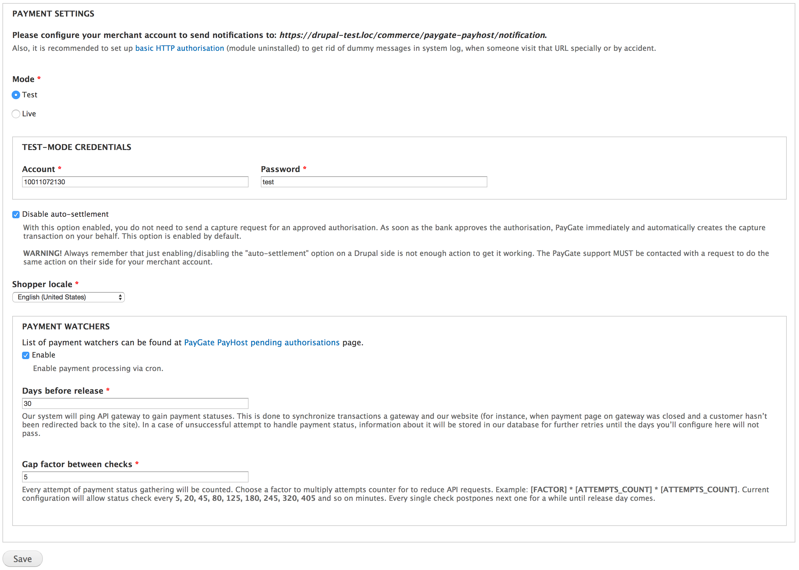
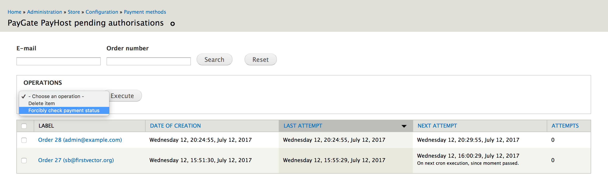

# Commerce PayGate PayHost

Sell your goods using [PayGate PayHost](https://www.paygate.co.za/paygate-products/payhost) as a payment gateway.

## Dependencies

- [Autoload](https://www.drupal.org/project/autoload)
  Loads all OO stuff for you.
- [Elysia Cron](https://www.drupal.org/project/elysia_cron)
  Checks incomplete payments, when a customer hasn't come back to the website.
- [Commerce Utilities](https://www.drupal.org/project/commerce_utils)
  Unified, object-oriented interface for building payment methods.

## Usage

Configure the payment method at `Store » Configuration » Payment methods » PayGate PayHost` (`admin/commerce/config/payment-methods/manage/commerce_payment_commerce_paygate_payhost`).



### Pending authorisations

To see the list of uncompleted payments you have to enable the `commerce_payment_watcher_ui` and clear the cache. After this it will appears at `Store » Configuration » Payment methods » PayGate PayHost pending authorisations` (`admin/commerce/config/payment-methods/payment-watchers/commerce-paygate-payhost`).

Moreover, there you'll be able to forcibly check payment status using an appropriate action.



## Tests

```bash
drush dl drupal-7 --drupal-project-rename=commerce_paygate_payhost_test
cd commerce_paygate_payhost_test
drush dl commerce_paygate_payhost autoload entity views ctools commerce_utils commerce rules addressfield composer_manager elysia_cron
drush si minimal --db-url="mysql://root@localhost/commerce_paygate_payhost_test" --account-pass=propeople -y
drush en simpletest -y
php ./scripts/run-tests.sh --color --verbose 'commerce_paygate_payhost'
```
